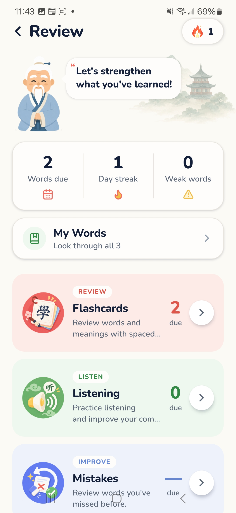

# Chinese Easy

A Mandarin learning app for iOS, Android and the web — spaced-repetition vocabulary, stroke-order writing practice, a 46-story reading library with an audiobook mode, and pronunciation scoring from the device microphone.

Built with React Native, Expo and TypeScript. **~44,000 lines of TypeScript** across 27 screens, 63 components and 39 library modules.

> **Status:** active personal project, pre-release. Two finished subsystems (structured Lessons and an XP-funded "My Town") are built and compiled but hidden behind feature flags in `src/lib/features.ts` while the core loop is tuned.

---

## Screenshots

Running on a physical Android device.

| Dashboard | Dictionary | Review | Settings |
|:---:|:---:|:---:|:---:|
|  |  |  |  |

**▶ [Watch the demo recording](https://github.com/NelsonHsu88/Chinese-Easy/releases/download/v0.1.0-preview/chinese-easy-demo.mp4)** — a walkthrough of the app on a real device.

---

## What it does

**Vocabulary with a real scheduler.** 25,180 frequency-ranked learning words, scheduled by [FSRS](https://github.com/open-spaced-repetition/ts-fsrs) rather than the usual SM-2 approximation. A further 81,437 reference entries are searchable, for 106,617 words total.

**Stroke-order writing.** Every character in the learning bank ships with stroke data — 5,378 glyphs, in *both* traditional and simplified — so writing practice works fully offline whichever script you chose.

**A reading library.** 46 hand-authored stories from HSK 1 to 6: folk tales, chengyu stories, festival legends and classical myths. Tap any word to look it up or add it to your deck.

**An audiobook mode.** Stories read aloud with a transport bar and a cursor tracking the current word.

**Pronunciation practice.** Speech recognition graded on *sound* rather than spelling — see below.

**Both scripts, everywhere.** Traditional and simplified are a real preference honoured by the dictionary, the writing practice, the placement test and the reading library alike.

---

## Engineering worth a look

If you only read one section, read this one. These are the problems that turned out to be harder than they sounded.

### Pronunciation scoring compares sounds, not characters

The obvious implementation asks whether the recogniser's text contains the target's characters — which grades *the engine's guess at meaning*, not the learner's mouth. Say 謝謝 perfectly and get marked wrong because the recogniser wrote 寫寫.

[`src/lib/pronunciation.ts`](src/lib/pronunciation.ts) decomposes both sides into syllables (initial, final, tone) and scores them with deliberately weighted components — initial 0.45, final 0.40, tone 0.15, plus a compounding penalty for tone errors after the first. The target slides along the heard syllables and the best window wins, so a recogniser padding 謝謝 into 是謝謝 costs nothing. Interim results feed a per-syllable "heard" flag, so each character turns green as you land it.

### Rebuilding a timeline a text-to-speech engine refuses to give you

Speech synthesis exposes no duration, no current time and nothing to seek. The only position signal is a `boundary` event carrying a character offset — and Chrome fires **no boundary events at all** for network voices, which is why the reading cursor once froze on the first word.

[`src/lib/narration.ts`](src/lib/narration.ts) reconstructs the whole transport from that one number: a rate estimator learns each voice's real speed (clamped, because engines batch boundary events and a pause at a comma implies an absurd rate), ±5s seeks convert to character offsets snapped to word edges, and a page spoken start-to-finish calibrates the *next* page even from a voice that reported nothing. Voice selection penalises remote voices so a local one wins, and a clock-driven predicted cursor runs until the first real boundary arrives.

### Segment first, convert second

Stories are authored canonically in traditional and *displayed* in the learner's script. The ordering is the entire design: text is matched against the word bank first, and only each segment's display form is converted afterwards. Convert the string up front instead and you segment simplified text against a traditional index, silently killing the lookup on every word whose forms differ.

So a simplified learner tapping 学校 and a traditional learner tapping 學校 reach the same dictionary entry, and progress, pagination and deck identity never notice the conversion happened. A build-time invariant enforces it: the word-bank builder exits non-zero rather than emit an entry whose two forms differ in character count.

### A dictionary ranking that stopped ranking by obscurity

English matches originally shared one score, so ties fell through to *character count* — a ranking by rarity, since a rare single character always wins it. Searching "cake" put 蛋糕 seventh, beneath a classifier whose gloss merely mentioned the word.

[`src/lib/dictionary.ts`](src/lib/dictionary.ts) now separates four tiers of English match and breaks ties on frequency-derived HSK level. Pinyin prefixes only count on syllable boundaries — "shui" of "shuǐ guǒ" is someone typing a word, "red" inside 熱帶's "redai" is a coincidence of spelling, and the coincidence used to win. Per-entry scoring work is memoised in a `WeakMap`, taking a typical query from ~45ms to ~4ms.

### Stroke-order animation inside a WebView

`hanzi-writer` draws into real SVG and has no React Native port, so [`src/components/HanziStage/`](src/components/HanziStage/) runs it inside a WebView and bridges its lifecycle back into ordinary React callbacks. The library is embedded as a generated string constant rather than fetched, so writing practice works with no network.

### A placement test that couldn't be gamed

Wrong answers were originally drawn from the same pool the test asks about — so a word that had already been an answer couldn't be a later one, every question answered made the rest easier, and the estimate drifted high, *placing beginners above their level*. Distractors now come from the curated words a given attempt doesn't ask about, ordered nearest-HSK-level-first so an HSK 6 word never sits beside an HSK 1 answer. Exclusion matches on the rendered label rather than the word, because 高興 and 快樂 both reduce to "happy".

### Credentials do not live with app state

The Supabase session is a **credential** — it carries a refresh token that mints access tokens indefinitely — so it lives in `expo-secure-store`, not in the AsyncStorage blob holding everything else. AsyncStorage is unencrypted on both platforms, and Android's default `allowBackup=true` was sweeping the same file into Google Drive. The value is chunked (SecureStore refuses >2048 bytes, and a session is two JWTs plus a user record), with the part count written *last* so a half-finished write reads as no session rather than a truncated one.

A [pre-install build hook](scripts/assertBuildEnv.mjs) fails any release build whose public env vars are missing, or that carries something resembling a `service_role` key — a value that would otherwise be inlined into the shipped bundle.

---

## Tech stack

| | |
|---|---|
| **Framework** | React Native 0.81 · Expo SDK 54 · Expo Router (file-based) |
| **Language** | TypeScript (strict), type-checked in CI-style via `tsc --noEmit` |
| **Styling** | NativeWind v4 (Tailwind for RN) |
| **Scheduling** | `ts-fsrs` |
| **Backend** | Supabase — Postgres with Row Level Security |
| **Native** | expo-speech · expo-speech-recognition · expo-audio · expo-haptics · expo-secure-store |
| **Rendering** | react-native-svg · react-native-webview (stroke animation) |
| **Targets** | iOS · Android · web (react-native-web) |

---

## Running it

```bash
npm install
npm start          # Expo dev server — scan the QR with Expo Go
npm run web        # or run it in a browser
```

Optional — the app runs signed-out without it:

```bash
cp .env.example .env   # then fill in Supabase URL + anon key
```

Checks:

```bash
npx tsc --noEmit   # type-check
npm test           # unit tests
```

`npm test` covers the two places where a quiet mistake stays invisible until it has already cost the learner something: the FSRS scheduler (bad maths costs weeks of reviews before anyone notices — every test fixes its own clock, none may read the real time) and the placement test's fairness properties (that no option is ever another question's answer, and that the word set varies between attempts — both were real defects, and neither is visible by looking at one question).

---

## Layout

```
src/
  app/          Expo Router routes — thin re-exports of screens
  screens/      Screen implementations (edit these, not the routes)
  components/   Reusable UI, grouped by the screen family it serves
  lib/          Business logic (pure, testable) and platform bridges
  data/         Word bank, stories, radicals, generated indices
  assets/       Fonts, stroke data, artwork, pre-rendered audio
scripts/        Asset and data generators — run by hand, output committed
supabase/       Schema and Row Level Security policies
```

`src/lib/` is split by whether a module touches a platform API: pure logic on one side, thin swappable bridges on the other.

Design notes and the reasoning behind the non-obvious decisions live in [`CLAUDE.md`](CLAUDE.md).

---

## Attribution

Dictionary data from [CC-CEDICT](https://cc-cedict.org/) (CC BY-SA 4.0); example sentences from [Tatoeba](https://tatoeba.org/) (CC BY 2.0 FR); character stroke data from [Make Me a Hanzi](https://github.com/skishore/makemeahanzi) via `hanzi-writer-data` (LGPL / Arphic Public License); radical data from the [Unicode Unihan database](https://unicode.org/charts/unihan.html).

Example sentences are drawn from that bundled corpus and are never machine-generated — a word with no attested sentence simply shows none.
